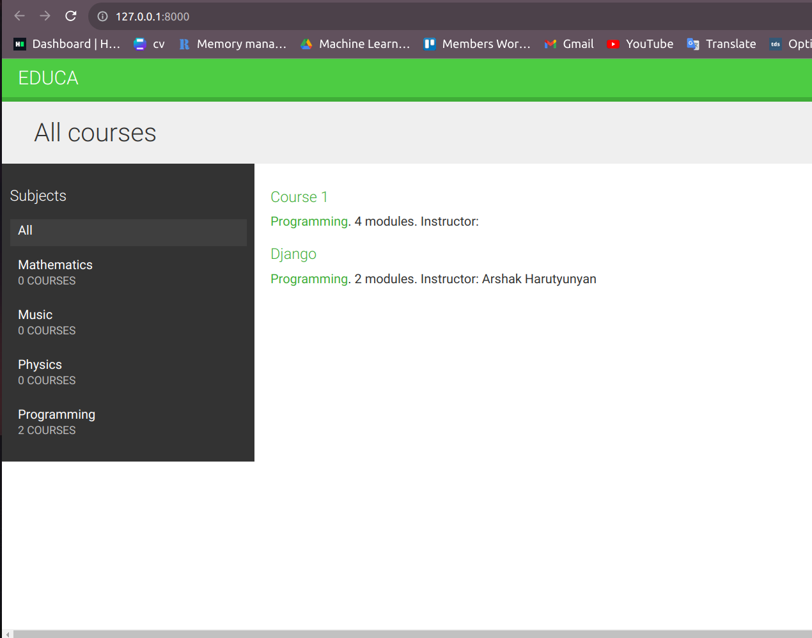
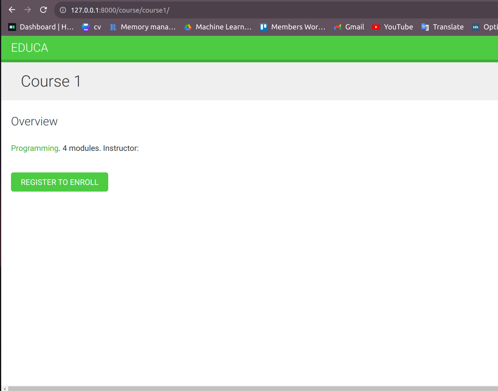
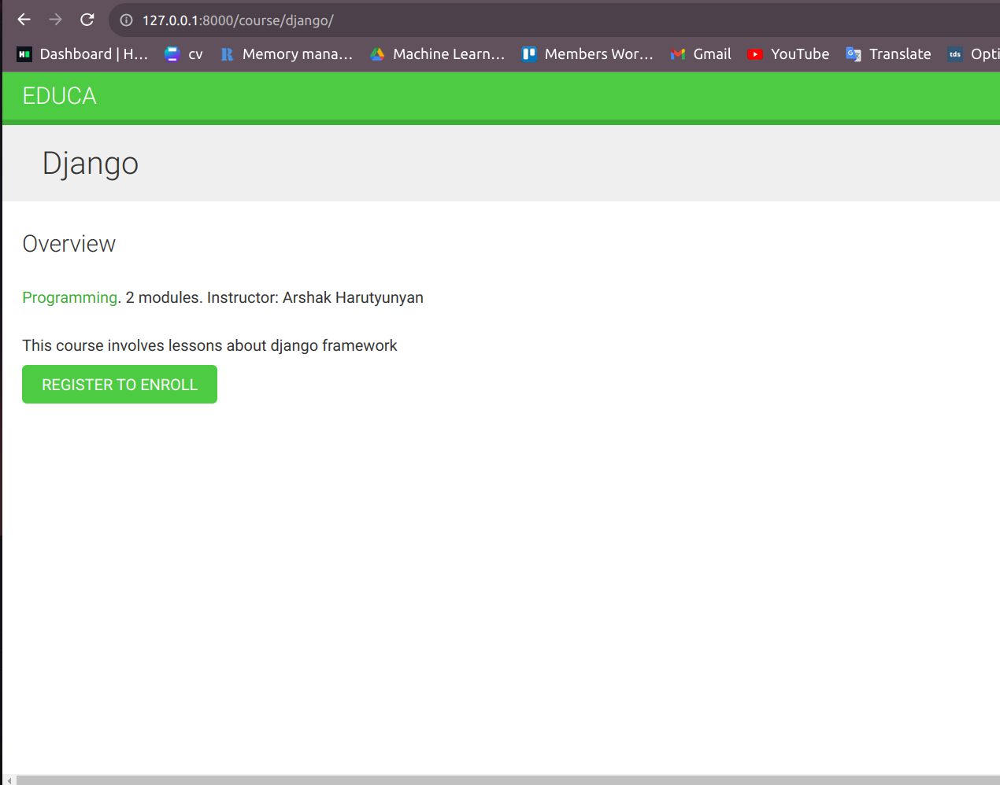
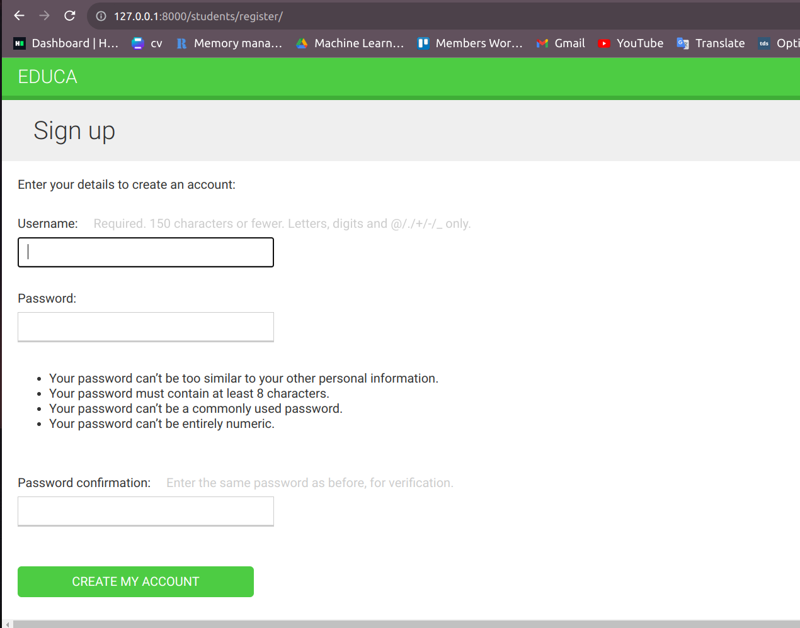
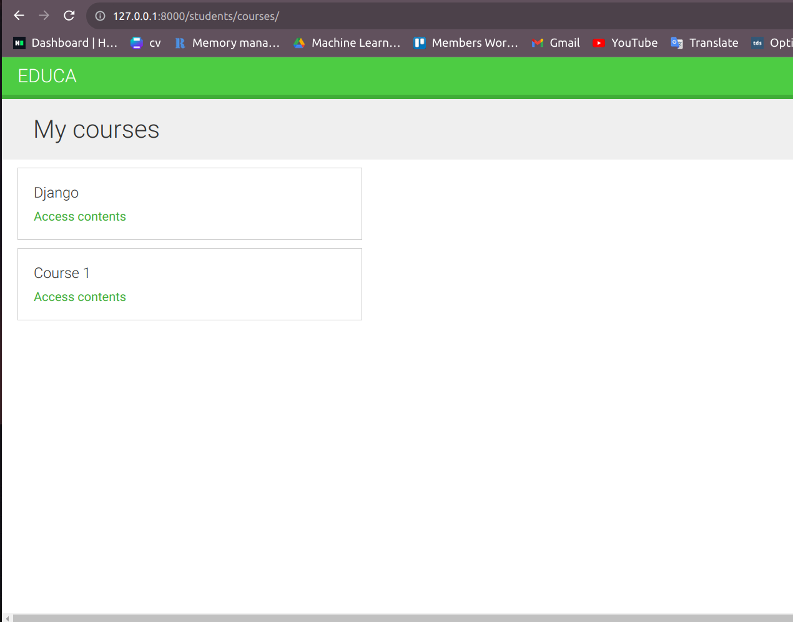
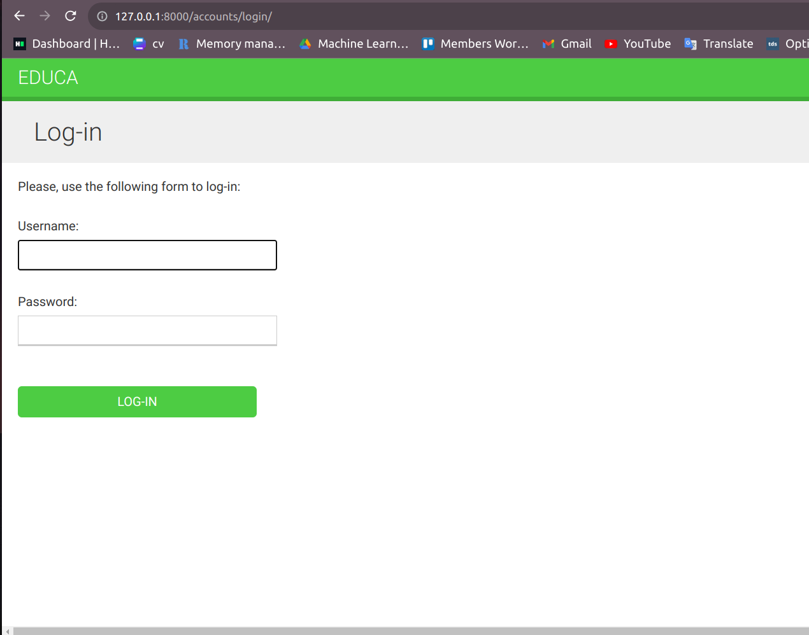

# EducationalCoursesDashboard
This project involves some courses, groups of users, those can manage all the content and many other tools for control.
#
## Installation

### Install the environment

Use the Anaconda.

```bash
conda create -n educa python=3.10
conda activate educa
```
Use pip to install all libraries and packages with their dependencies
```bash
pip install -r requirements.txt
```
## Usage

```bash
python manage.py runserver
``` 

Here are some screenshots from my project. 








